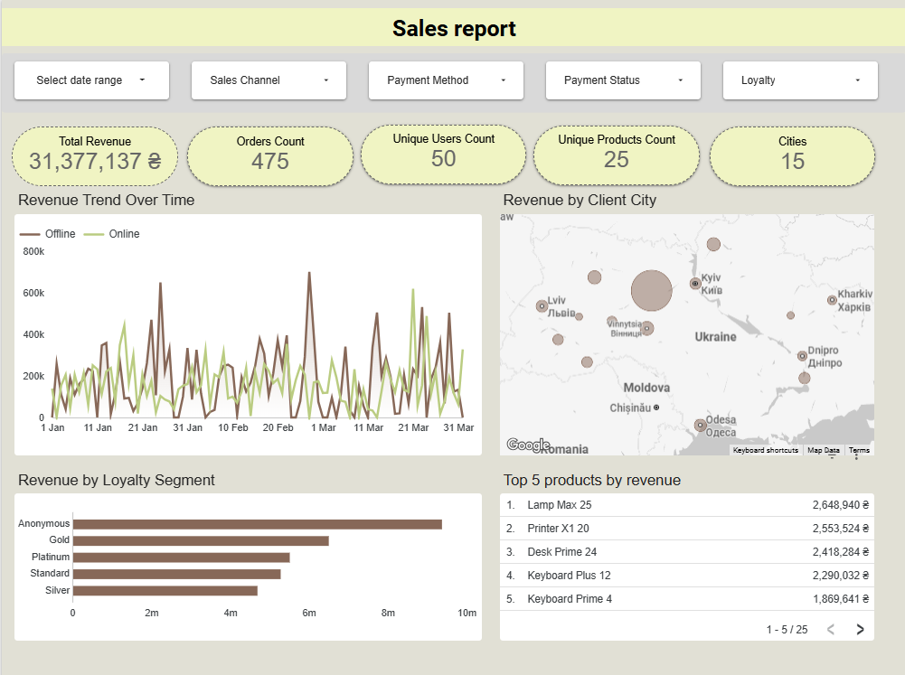

# 📊 Electronics Sales Analytics Dashboard



An interactive sales analytics dashboard built in **Looker Studio** using a custom SQL dataset prepared from a relational database.

The project demonstrates the complete analytical workflow: data extraction, transformation, and visualization to answer key business questions.

---

## 📌 Business Problem

The management of an electronics store wants to better understand sales performance and identify the main factors affecting revenue.

The dashboard answers the following business questions:

- How are sales distributed across customers, products, and cities?
- Which customer loyalty segments generate the highest revenue?
- How does revenue change over time?
- How does revenue differ between online and offline sales channels?
- Which products and cities contribute the most to total revenue?

---

## 📊 Dashboard Overview

The dashboard consolidates online and offline sales into a single analytical view, enabling business users to monitor revenue trends, customer behavior, product performance, and sales distribution across different channels through interactive filters and KPI visualizations.

---

## 🛠 Tech Stack

- PostgreSQL
- SQL
- Looker Studio
- Data Visualization

---

## 🗄 Data Preparation

A custom SQL query was created to prepare a unified analytical dataset by combining online and offline sales.

The query includes:

- Common Table Expressions (CTE)
- INNER JOIN
- LEFT JOIN
- UNION ALL
- Data normalization
- Online and offline sales integration

The SQL script is available in:

```text
sql/sales_dataset.sql
```

---

## 📊 Dashboard Features

The dashboard includes:

- Revenue trend analysis
- Revenue by sales channel
- Revenue by city
- Revenue by customer loyalty segment
- Top-selling product categories
- Interactive filters
- Dynamic KPI calculations

---

## 🔗 Live Dashboard

👉 **Open Interactive Dashboard**

https://datastudio.google.com/reporting/dd81d747-d0d3-4df7-b7a1-a88b3c38f6d5

---

## 📁 Repository Structure

```
Looker-studio-sales-dashboard/
│
├── dashboard/
│   └── dashboard.pdf
│
├── screenshots/
│   └── Overview.png
│
├── sql/
│   └── sales_dataset.sql
│
└── README.md
```

---

## 📈 Skills Demonstrated

- SQL data preparation
- Data modeling
- Business analytics
- Dashboard design
- KPI visualization
- Interactive reporting

---
Created as part of the GoIT Data Analytics course.
